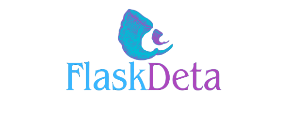

# OVERVIEW

**Welcome to Flask-Deta documentation!**

Flask-Deta is a Python library that simplifies the integration of your [DetaSpace](https://deta.space/) collection of database and/or drive files with [Flask](https://flask.palletsprojects.com/en/2.3.x/) framework. 

With Flask-Deta, you can store and manage data with `DetaBase` and handle file storage operations with `DetaDrive`, all within the context of your Flask application. This robust combination allows you to leverage the secure and scalable cloud infrastructure of [DetaSpace](https://deta.space/), making data and file management for your web projects convenient. 

In this documents, we will provide you with an in-depth overview of Flask-Deta and help you get started using this extraordinary tool.

> With DetaSpace's free cloud storage you can easily store and manage data and files in your Flask applications.

<!----------------------------USER GUIDE----------------------------------->
## User Guide
For comprehensive information on how to use Flask-Deta, please refer to our User Guide, which covers the following topics: 

- #####  Getting started
    * [Installation](./guide/install.md)
    * [Configurations](./guide/config.md)
    * [Quickstart](./guide/start.md)
- ##### Api reference 
    * [DetaBase](./detabase/base.md)
    * [DetaDrive](./detadrive/drive.md)
- ##### About
    * [License](./about/LICENSE.md)
    * [Changes](./about/changelog.md)
    

<!----------------------------INTRODUCTION----------------------------------->

## What is Flask-Deta?
Flask-Deta is a library developed to streamline data and file storage and management in web applications created with Flask. By integrating DetaSpace Base and DetaSpace Drive with Flask, Flask-Deta enables you to leverage the secure and scalable infrastructure of Deta for your data and file storage needs in your web project.

<!----------------------------FEATURES----------------------------------->
## Key Features
- **Simple Interface**: Flask-Deta provides a user-friendly and straightforward interface to interact with Deta Base and Deta Drive.

- **Versatility**: With Flask-Deta, you can store and retrieve data from Deta Base, as well as upload, download, and delete files with Deta Drive.

- **Quick Setup**: Configuring Flask-Deta in your Flask application is fast and direct, allowing you to focus on the development of your project.

<!----------------------------SOURCE CODE----------------------------------->
## Source Code

The **[source code](https://github.com/Jesparzarom/Flask-Deta)** of this project is available on GitHub and is open-source under the _BSD 3-Clause License_. We invite developers and contributors to explore the codebase. 

> The codebase relies on the Flask and Deta libraries, which are essential components driving the functionality of this project.

<!----------------------------ISSUES----------------------------------->
## Issues

If you find any issues or have ideas for improvements, feel free to open an issue on [GitHub Repo/issues](https://github.com/Jesparzarom/Flask-Deta/issues/new).

<!----------------------------lICENSE----------------------------------->
## License

Flask-Deta is licensed under the BSD 3-Clause License. See [LICENSE](./about/LICENSE.md) for more details.

By using this project, you agree to abide by the terms of the BSD 3-Clause License. We encourage you to review the license for more details. This license ensures that this project remains open-source and freely accessible to the community, fostering collaboration and innovation.

<!----------------------------AUTHOR/S----------------------------------->
## Authors

J.P. Esparza | [jesparzarom](https://github.com/Jesparzarom)

<!----------------------------SPONSORSHIP----------------------------------->
## Sponsor the Project
If you find Deta-Flask valuable and want to contribute to its continued development and maintenance, consider sponsoring the project. Your sponsorship will help support the developers' efforts to enhance the library, fix issues, and add new features.

By sponsoring Deta-Flask, you ensure that it remains a reliable and powerful tool for integrating DetaSpace's collections functionalities with Flask.

Your support is greatly appreciated and will contribute to the success and sustainability of the project. Together, we can make Deta-Flask even better!

<!----------------------------LOGO----------------------------------->
---

> In this project, we would like to extend our sincere appreciation to the creators and maintainers of the Flask and Deta libraries. Flask, a powerful web framework, has played a crucial role in the development of this project, while Deta, with its efficient data storage and management capabilities, has greatly contributed to its success. Without these remarkable open-source libraries and the efforts of their dedicated communities, this project would not have been possible. We express our gratitude to the Flask and Deta teams for their outstanding work, which has enriched the development experience and functionality of this project.

---